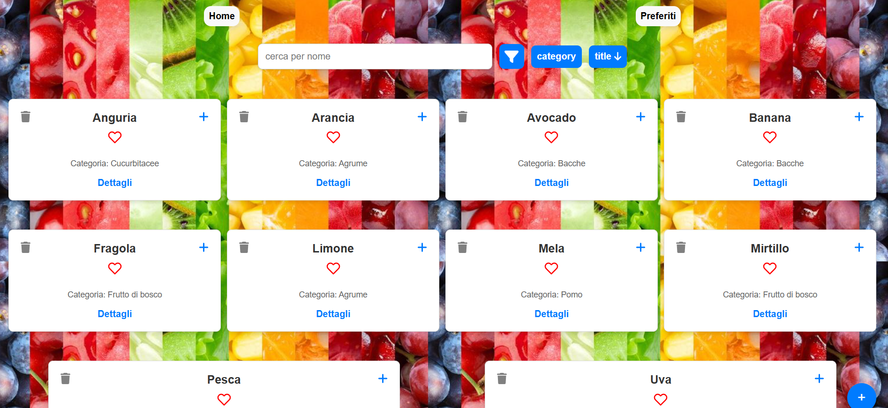

# Healthy Bites

Healthy Bites è un'applicazione web interattiva per la gestione e l'analisi dei dati nutrizionali della frutta. Consente agli utenti di cercare, filtrare, ordinare e confrontare frutti, oltre ad aggiungere nuovi dati nutrizionali personalizzati.

## Funzionalità principali

- **Ricerca e filtro**: Cerca i frutti per nome e filtra per categoria.
- **Ordinamento**: Ordina i frutti per titolo o categoria.
- **Gestione dei dati**: Aggiungi nuovi frutti con informazioni nutrizionali personalizzate.
- **Confronto**: Confronta più frutti per analisi comparative.
- **Interfaccia intuitiva**: Design moderno e facile da usare.

## Tecnologie utilizzate

- **React**: Libreria per la creazione dell'interfaccia utente.
- **Vite**: Tool per il build e lo sviluppo rapido.
- **Lodash**: Per ottimizzare le interazioni con debounce.
- **React Router**: Per la navigazione tra le pagine.
- **FontAwesome**: Per le icone.

Demo Live: **https://healty-bites.vercel.app/**

## Screenshot

